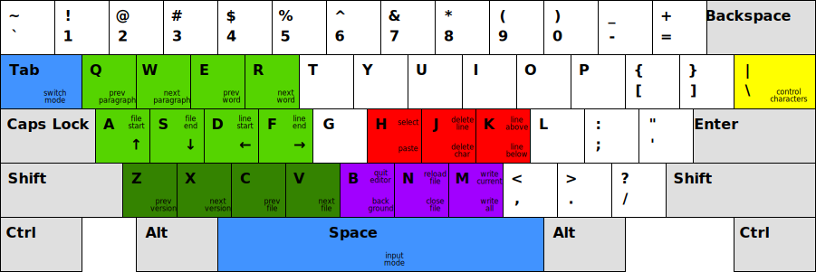
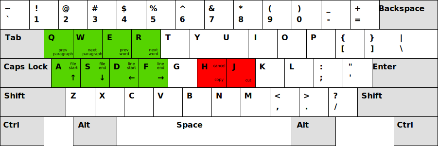
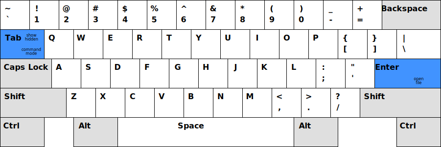
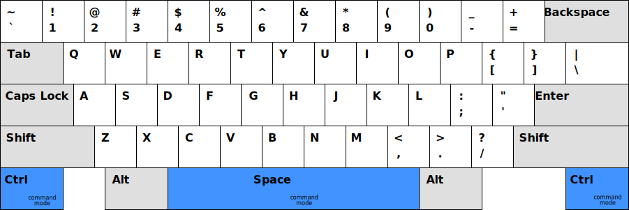

# Text editor

Minimalistic text editor designed to effectively work with multiple files and external tools.

## Installation

To install or update run the following command.

```sh
cargo install --git https://github.com/grzegorz-zur/te.git --root ~/.local
```

## Usage

```sh
te
```

### Command mode

Execute commands.



### Select mode

Select text and performs operation on the selection



### Switch mode

Type to filter files. Navigate with cursor keys and press enter to select a file.



### Input mode

Type to input text in the current file.


